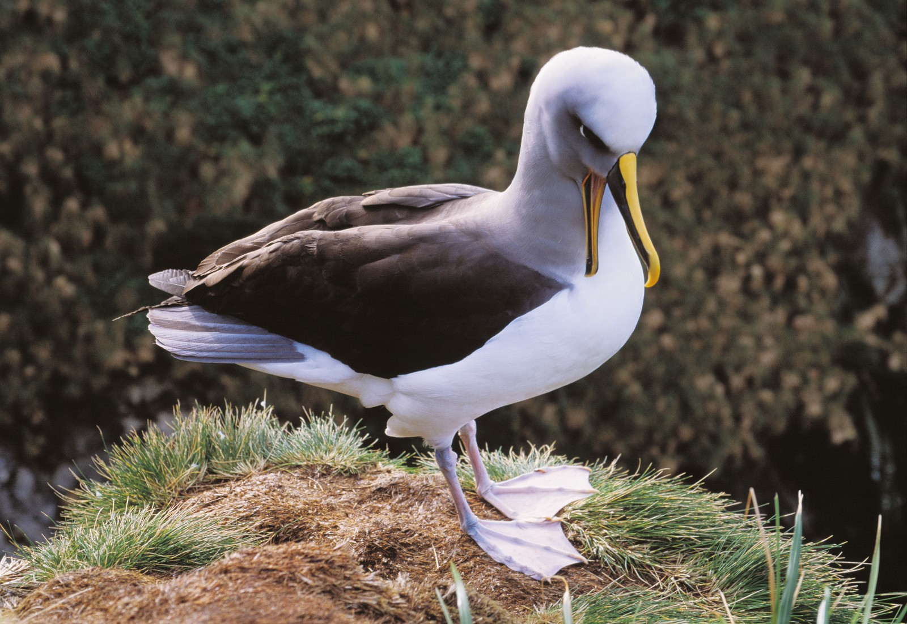

# Introduction

From Wikipedia: The mollymawks are a group of medium-sized albatrosses that form the genus Thalassarche.

_( Bird image from New Zealand Geographic https://www.nzgeo.com/stories/a-wing-and-a-snare/ )_

Mollymawk here, is a web interface for remotely managing albatross. Mollymawk provides an easy web interface to manage a fleet of unikernels, which maybe deployed over multiple albatross servers.

Both as an interactive user interface to point and click deploying and destroying unikernels, as well as a REST API with authentication.

This guide contains information about Mollymawk.

If you find typos, or find parts difficult to understand, please report an issue
or pull request at
[the source repository](https://github.com/robur-coop/mollymawk-handbook).
