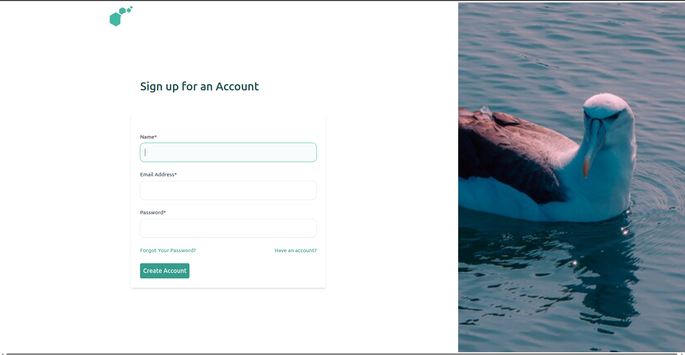
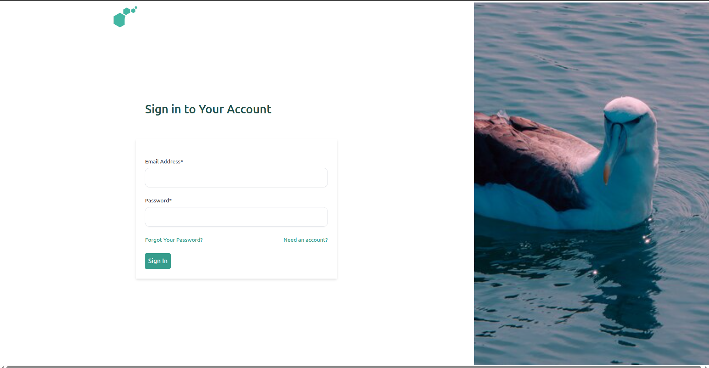

# Creating an Account on Mollymawk

Accounts on Mollymawk are how a user is able to access the mollymawk dashboard and perform various actions.

## Creating a new account

You can create a new account by navigating to the `/sign-up` endpoint.

To create an account on molllymawk, you need to provide a name, email and a password.

## The First Account

When a new instance of Mollymawk is deployed, the database is initially empty. The platform contains specific logic to handle the very first registration differently from all others.

*   **Automatic Admin Status:** The first user to register on the platform is automatically granted **Super User (Admin)** privileges.
*   **Automatic Activation:** This initial account is also automatically **activated** upon creation, allowing immediate access to the dashboard without requiring approval.

This mechanism ensures that the owner of the Mollymawk instance can immediately log in and begin managing the system and subsequent users.

## Standard User Registration
For all users registering after the initial administrator, the process includes a security step to prevent unauthorized access.

*   **Default Status:** When a subsequent user registers, their account is created with `active` set to `false` and `super_user` set to `false`.
*   **Pending Approval:** These accounts cannot access the system immediately. They remain in an inactive state until they are manually approved by an administrator.

## Account Administration
Management of user access and albatross policies is restricted strictly to users with administrative privileges.

### Activating Accounts
Because standard accounts are created as inactive, an administrator must log in to the dashboard to approve them.
*   **The Process:** An admin can view a list of users and select a specific account.
*   **Activation:** The admin uses the "Activate" button on the user's profile to grant access.

### Granting Admin Privileges
Only an existing administrator can promote another user to an admin role.
*   **Privilege Escalation:** An admin can promote a standard user by selecting "Make Admin" in the user interface.
*   **Security Check:** The system verifies that the requestor is an admin before processing the request.
*   **Safety Lock:** The system prevents the deactivation or removal of administrator privileges if the target user is the *last* remaining active administrator or active user, ensuring the system never becomes locked out.

## Logging in

You can log in to an account by navigating to the `/sign-in` endpoint.

To access your account in Mollymawk, use the sign in page. Enter the email you created the account with and your password. If all checks out, you should be redirected to the dashboard.

## Email Verification

This functionality is not yet functional.

## Recovering Accounts

Resetting forgotten passwords is not yet functional.

## Removing an Account

This action can only be performed by an account with Administrator priviledges. To remove an account from Mollymawk, from the user's page, click the `Delete User` button.