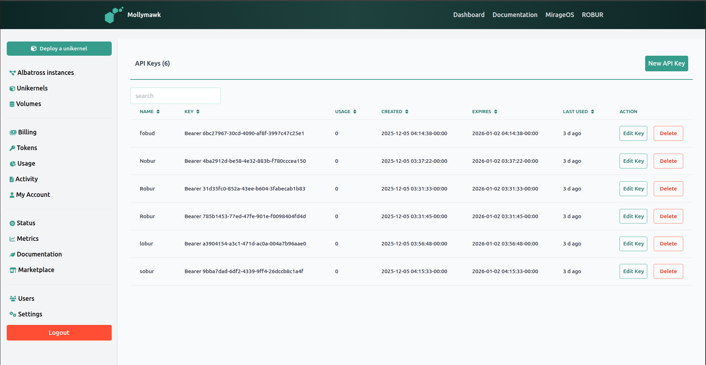
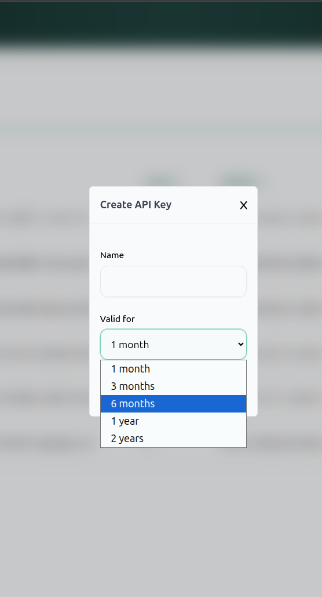

# Tokens

In Mollymawk, Tokens are authentication credentials designed for programmatic access and automation rather than interactive browser sessions.

**Primary Uses:**
*   **External Automation:** Tokens allow external scripts or CI/CD pipelines to interact with the Mollymawk API without a human user logging in via the web interface. They are essential for automated deployments,.
*   **Bearer Authentication:** Unlike browser sessions that use cookies, these tokens are passed in the HTTP headers of requests. The backend explicitly checks for these tokens to validate requests for API-specific endpoints.
*   **Resource Management:** Tokens grant permissions to perform critical operations, including:
    *   **Unikernels:** Listing, creating, restarting, destroying, and updating unikernels.
    *   **Volumes:** Creating, uploading data to, and deleting block storage volumes.
*   **Usage Tracking:** The system tracks how often a token is used. The dashboard displays a "Usage" count and a "Last Used" timestamp (e.g., "3 d ago") for every key, allowing users to monitor activity.

### Creating a new token

Tokens are generated via the user dashboard. The process involves the following steps:

1.  **Access the Token Page:** Navigate to the **Tokens** tab in the sidebar menu.
2.  **Initiate Creation:** Click the **New API Key** button located in the top right corner of the page.
3.  **Configure the Key:** A modal window titled "Create API Key" will appear. You must provide:
    *   **Name:** A label to identify the token (e.g., "Github CI").
    *   **Validity Period:** You must select an expiration duration from the dropdown menu. Options include **1 month**, **3 months**, **6 months**, **1 year**, or **2 years**.
4.  **Generation:** Clicking the create button the backend to generate the token, save it with the specified expiration, and return it to the user.

Think of your **Password** as your **ID Badge**. You use it to walk through the front door (login) and work at your desk (dashboard).
A **Token** is like a specific **Service Key** you give to a delivery driver or a contractor. You give it to them so they can drop off packages (deploy code) or pick up items (download volumes) automatically without you needing to be there to open the door for them every time. Furthermore, this key automatically expires after a set time so they can't use it forever.