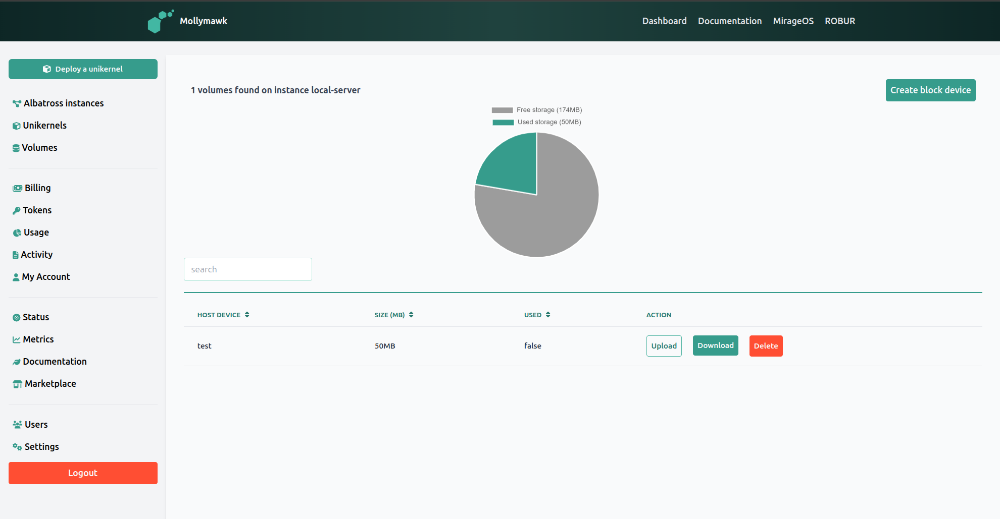
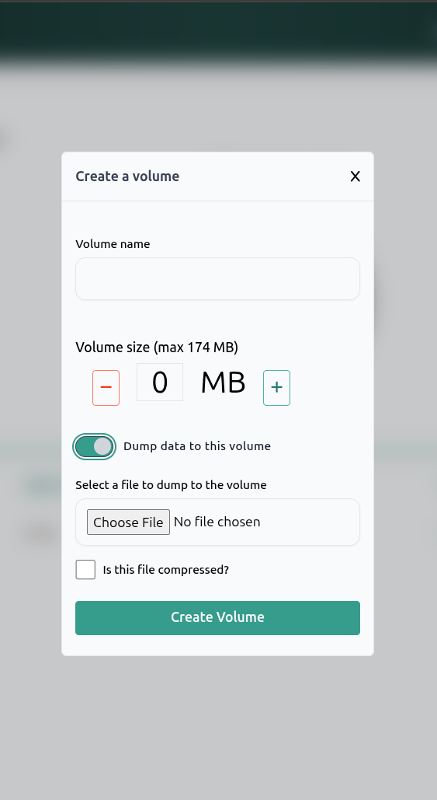

# Volumes

In the context of Mollymawk and MirageOS, a Volume is a persistent **block storage device**. While a unikernel's RAM is volatile (data is lost when the unikernel stops or restarts), Volumes provide a way to store data permanently. These are logical chunks of disk space allocated on the host server (Albatross instance) that can be attached to your unikernels.

The Volumes dashboard allows for full lifecycle management of these storage units:

*   **Data Transport (Upload/Download):** Unlike many standard cloud block storage systems that only allow attachment, Mollymawk provides direct data access via the browser.
    *   **Upload:** Users can upload data directly into a volume. The creation modal even includes a toggle to **"Dump data to this volume"** immediately upon creation.
    *   **Download:** Users can download the entire contents of a volume as a binary file (octet-stream) via the dashboard.

## Creating a new Volume

Click on the `Create block device` button. A modal should display which contains the form for creating a new volume. 

*   **Creation and Sizing:** Users can create new block devices by specifying a **Volume name** and a **Volume size** (measured in Megabytes). The interface automatically calculates the maximum size available based on the user's resource policy (e.g., "can assign up to: 174 MB").

We have a toggle `Dump data to this volume` which allows us to upload files to the block device upon creation. If the file we are uploading is a compressed file, be sure to activate the `Is this file compressed` checkbox.

## Integration with Unikernels
Volumes are designed to be "plugged in" to unikernels at boot time.
*   **Attachment:** During the unikernel deployment process, there is a specific configuration section for **Block devices**.
*   **Mapping:** When attaching a volume, the system maps the **Host Device** (the volume you created) to a **Unikernel Block Device** name (how the application sees the disk).
*   **Persistence:** This setup allows a unikernel to write logs, database files, or other critical data to the volume, so that even if the unikernel is destroyed and redeployed, the data remains safe on the volume.

If a unikernel is like a **game console**, the Volume is the **memory card**. You can turn the console off or even buy a brand new one (redeploy a new unikernel), but as long as you plug that memory card (Volume) into the new machine, your saved games and progress (data) are still there, exactly as you left them.